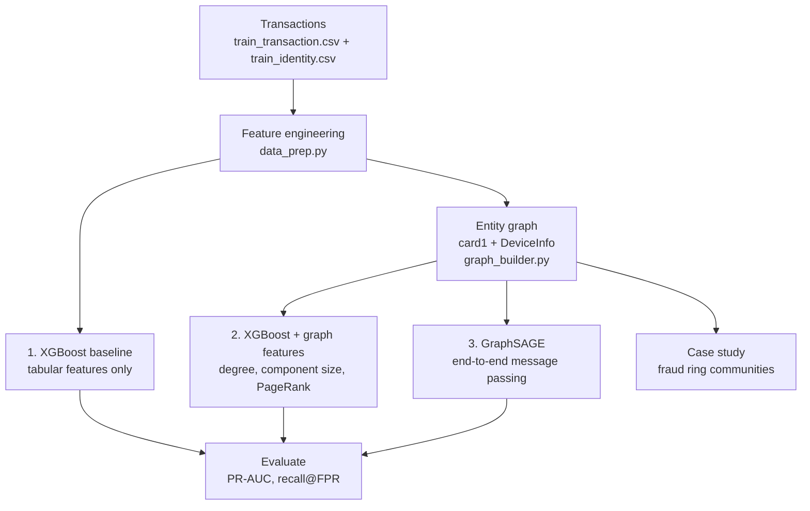

# FraudMesh

Graph-based fraud ring detection. Transactions are linked into a graph via
shared card and device identifiers, and a GraphSAGE model is trained on top
of that structure to catch coordinated fraud rings that a row-by-row model
can't see.

Three models are trained on the same data and split, so the graph's value
is measured, not assumed:

1. **XGBoost baseline** — tabular features only, no graph
2. **XGBoost + graph features** — same features, plus cheap graph
   statistics (degree, component size, PageRank)
3. **GraphSAGE** — full message-passing model on the entity graph

This repo reports whichever result actually comes out of a run, not the
one that makes the best story.



## Results

### Synthetic data (20k rows, injected fraud rings)

| Model | PR-AUC | Recall @ 1% FPR | Recall @ 5% FPR |
|---|---|---|---|
| XGBoost (baseline) | 0.8107 | 0.7862 | 0.7931 |
| XGBoost + graph features | 0.8111 | 0.7793 | 0.8069 |
| GraphSAGE | 0.8227 | 0.7931 | 0.8138 |

Cheap graph stats add almost nothing here (+0.0004 PR-AUC). Nearly all the
graph's value shows up only with full GraphSAGE message passing
(+0.0120 over baseline). Validated on synthetic data only — see below.

**Case study** (`src/case_study.py`): finds a 502-transaction component
spanning 25 cards and 22 devices, 97.4% fraud — a ring invisible to any
row-by-row model.

### Real IEEE-CIS competition data

| Model | PR-AUC | Recall @ 1% FPR | Recall @ 5% FPR |
|---|---|---|---|
| XGBoost (baseline) | 0.5131 | 0.4259 | 0.6245 |
| XGBoost + graph features | 0.5125 | 0.4210 | 0.6235 |
| GraphSAGE (with graph) | 0.4369 | 0.3676 | 0.5573 |
| GraphSAGE (`--no-edges`, graph stripped) | 0.4307 | 0.3681 | 0.5517 |

**On real data, the graph adds essentially nothing — confirmed two
independent ways.** Graph-features XGBoost is flat vs. the tabular
baseline, and GraphSAGE scores the same with or without its own edges
(0.4369 vs 0.4307). Real fraud "rings" here are mostly a single `card1`
value reused a handful of times, not the multi-entity clusters the
synthetic generator produces — thinner structure, thinner signal.

The remaining gap, GraphSAGE (~0.44) vs. XGBoost (~0.51), is a **model-
capacity difference, not a graph-value one**: a shallow neural net vs. 400
boosted trees on the same strongly-engineered tabular features — a
well-known pattern on tabular data generally. This directly contradicts
the synthetic-data conclusion above, which is the actual point: validate
on synthetic data, but never trust it as the final word. (GraphSAGE also
started this investigation badly broken at 0.20 PR-AUC — full-batch
training means one epoch is one gradient step, and 30 epochs was nowhere
near enough; fixed by training for 200 epochs with a cosine LR schedule.)

## Key design decisions

- **Only `card1` and `DeviceInfo` are graph edges.** `addr1` and
  `P_emaildomain` look like identity signals but are too coarse (a few
  hundred / ~60 unique values) — linking on them merges huge unrelated
  swaths of data into one giant component. Both stay available as
  frequency-encoded tabular features, just not as graph edges.
- **No raw component ID as a feature.** An earlier version fed
  `graph_component_id` to XGBoost — since the graph spans train+test, that
  let trees memorize a component's training fraud rate and "predict" test
  rows in the same component via ID match, not real generalization. PR-AUC
  dropped from 0.8165 to 0.8111 after removing it — the honest number.
- **Time-aware split**, not random — sorted by `TransactionDT`, last 20%
  held out. A random split would leak future patterns into training.
- **PR-AUC + recall@FPR**, not accuracy/ROC-AUC — fraud is ~3.5% positive,
  so accuracy is meaningless and ROC-AUC is optimistic under imbalance.
  Recall@FPR maps directly to "given a review-queue budget, what fraction
  of fraud do we catch?"
- **`max_edges_per_entity`** (`config.MAX_EDGES_PER_ENTITY`) skips any
  entity value linking more rows than this cap, treating it as too generic
  (e.g. a placeholder value) to be a real identity signal.

### Graph validation

Fraud rate climbs sharply with connected-component size on synthetic data
(1.0% → 12.8% → 93.2% as min. component size goes 1 → 10 → 20) — the
signal that justifies building the graph at all.

## Architecture

```
FraudMesh/
├── config.py                    # paths, Kaggle auto-detection, hyperparameters
├── requirements.txt              # local (venv) setup — pins numpy<2
├── environment.yml                # local (conda) setup
├── requirements-kaggle.txt       # Kaggle setup (just torch_geometric)
├── notebooks/fraudmesh_kaggle.ipynb
├── scripts/run_pipeline.sh       # runs all phases end to end
├── src/
│   ├── data_prep.py              # loading, features, time-aware split, synthetic generator
│   ├── metrics.py                # PR-AUC, recall@FPR
│   ├── graph_builder.py          # entity graph construction + validation
│   ├── train_baseline.py         # Phase 1: XGBoost, no graph
│   ├── train_graph_features.py   # Phase 3: XGBoost + graph statistics
│   ├── train_graphsage.py        # Phase 4: GraphSAGE
│   ├── case_study.py             # Phase 5: fraud ring reporting
│   └── serve.py                  # Phase 6: FastAPI serving
├── data/                          # Kaggle CSVs go here (gitignored)
├── models/                        # trained weights (gitignored)
└── results/                       # metrics JSON per phase
```

## Setup

```bash
git clone <this-repo> && cd FraudMesh
python3 -m venv venv && source venv/bin/activate
pip install -r requirements.txt
```

Or with conda: `conda env create -f environment.yml && conda activate fraudmesh`.

Both pin `numpy<2` (newer numpy breaks the torch build these deps resolve
to). macOS + XGBoost: `brew install libomp` if you hit a `libomp.dylib`
load error.

### Getting the data

Download `train_transaction.csv` + `train_identity.csv` from the
[IEEE-CIS Fraud Detection competition](https://www.kaggle.com/c/ieee-fraud-detection/data)
into `data/`. `train_identity.csv` is optional.

### Running on Kaggle

1. Upload this repo as a private Kaggle Dataset (recommended) or push it to
   a Git remote — `notebooks/fraudmesh_kaggle.ipynb` has a clone fallback.
2. Open the notebook, *Add Input → Competitions → IEEE-CIS Fraud Detection*.
3. Turn on a GPU, run all cells.

`config.py` auto-detects wherever `/kaggle/input` mounted the data and
always writes outputs to `/kaggle/working`. `requirements-kaggle.txt`
installs only `torch_geometric` — don't `pip install -r requirements.txt`
on Kaggle, it'll fight with the preinstalled GPU-matched torch.

**If a cell suddenly can't find `src/...`:** a Kaggle session restart wipes
`/kaggle/working` (not just the kernel) — re-run the setup cells (clone +
`pip install -r requirements-kaggle.txt`) from the top. `train_graphsage.py`
resumes from its checkpoint automatically once the environment exists again.

### Synthetic data mode

Every script accepts `--synthetic` — generates an IEEE-CIS-shaped dataset
locally (~3.5% fraud, injected rings + "lone wolf" fraud with no reuse
pattern) so the pipeline is testable without the 600MB+ real download.

## Running the pipeline

```bash
./scripts/run_pipeline.sh --synthetic   # fast, no download
./scripts/run_pipeline.sh               # real data, from data/

# or individually:
python3 src/train_baseline.py --synthetic
python3 src/train_graph_features.py --synthetic
python3 src/train_graphsage.py --synthetic
python3 src/case_study.py --synthetic
```

Use `--sample-frac 0.1` on any script for faster local iteration on real
data (fraud rows are always kept in full).

`train_graphsage.py` extras:
- **Resumes automatically** from `models/graphsage_checkpoint.pt` if
  interrupted (checkpointed every epoch, atomic writes, corrupted
  checkpoints fall back to a fresh start). `--fresh` ignores it.
- `--epochs N` — override the epoch count (default 200; full-batch, so
  this is the total gradient-step count). LR schedule state resumes too.
- `--no-edges` — diagnostic: strips graph edges to isolate whether the
  graph itself helps or hurts, writing to separate `*_noedges` files.

## Serving

```bash
cd src && uvicorn serve:app --reload
```

```bash
curl http://127.0.0.1:8000/health
curl -X POST http://127.0.0.1:8000/score -H "Content-Type: application/json" -d '{"transaction_id": 0}'
curl -X POST http://127.0.0.1:8000/refresh
```

GraphSAGE can't score a transaction in isolation — it needs the
transaction's graph neighborhood. `serve.py` uses a precompute-and-cache
strategy: `/refresh` rebuilds the graph and re-scores everything into an
in-memory cache, `/score` is then a fast lookup. `/health` reports
whether a real trained model is loaded (`model_trained`) — an untrained
model still serves plausible-looking but meaningless scores otherwise.

## Tech stack

XGBoost, PyTorch, PyTorch Geometric, NetworkX, FastAPI, pandas/scikit-learn.

## Deliberately out of scope

- **No true online/streaming inference** — the cache-refresh design is a
  real production pattern, not a shortcut.
- **No hyperparameter sweep** — one reasonable config; wouldn't change the
  ablation's shape.
- **No GNNExplainer-style tooling** — the case-study/community-detection
  approach gives a reviewer a concrete transaction list instead of an
  attribution heatmap.
