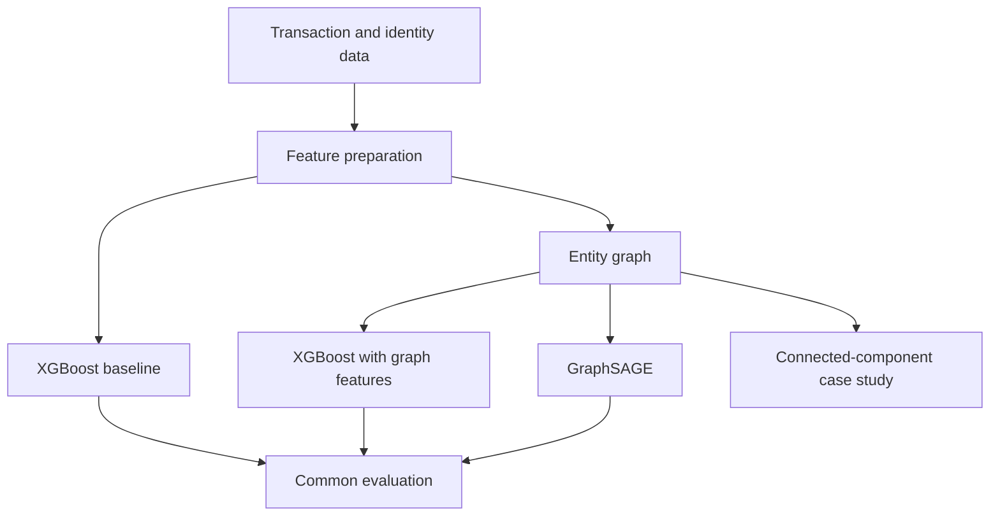

# FraudMesh

[](https://github.com/dhyanagni2001-commits/FraudMesh/actions/workflows/ci.yml)

FraudMesh is an experimental fraud-detection pipeline that represents transactions as a graph using shared card and device identifiers. It compares tabular models, graph-derived features, and a GraphSAGE model on the same data split.

The goal is to measure whether relationships between transactions provide useful fraud signals beyond standard transaction-level features.

## Motivation

Traditional fraud models usually score each transaction from its individual attributes. That approach can miss relationships between transactions, such as several cards repeatedly appearing on the same device.

I built FraudMesh to investigate three questions:

- Can shared identifiers reveal groups of related transactions?
- Do inexpensive graph statistics improve a tabular model?
- Does message passing with GraphSAGE provide additional predictive value?

The project includes both positive and negative findings. GraphSAGE performed better on data containing deliberately injected fraud rings, but the graph-based approaches did not outperform the tabular baseline on the IEEE-CIS data in the reported experiment.

## Models Compared

All three approaches use the same label split so their results can be compared consistently.

1. **XGBoost baseline** — uses transaction-level tabular features.
2. **XGBoost with graph features** — adds node degree, connected-component size, and PageRank.
3. **GraphSAGE** — learns node representations through message passing over the transaction graph.

An additional GraphSAGE run removes all graph edges. This ablation helps distinguish the effect of graph connectivity from the effect of the neural-network architecture itself.

## Pipeline



## Graph Construction

Each transaction is represented as a node. Transactions are connected when they share one of the following identifiers:

- `card1`
- `DeviceInfo`

The graph intentionally excludes `addr1` and `P_emaildomain` as edge-producing identifiers. These values are relatively coarse and can connect many unrelated transactions into very large components. They remain available to the tabular models as frequency-encoded features.

`max_edges_per_entity` limits connections created by identifiers that occur too frequently. This reduces the effect of generic or placeholder values.

## Evaluation

The main metrics are:

- **PR-AUC**, which is informative for imbalanced classification problems.
- **Recall at 1% false-positive rate**, representing a relatively small review budget.
- **Recall at 5% false-positive rate**, representing a larger review budget.

Accuracy is not used as the primary metric because fraud represents a small percentage of the data.

### Evaluation Scope

Transactions are sorted by `TransactionDT`, and the final 20% are used as the evaluation split.

The current graph construction is transductive: nodes from the full dataset are present when graph structure is created, although evaluation labels are not used for model training. The reported numbers should therefore be interpreted as an offline transductive experiment rather than a strict simulation of scoring entirely unseen future transactions.

A stricter production-oriented evaluation would construct the training graph only from information available before the split and attach later transactions without recomputing historical features from future data.

## Results

The following values were recorded using the current project configuration. They represent individual experimental runs rather than confidence intervals across multiple random seeds.

### Synthetic Data

The synthetic dataset contains 20,000 transactions with injected multi-entity fraud rings and independent fraud examples.

| Model | PR-AUC | Recall at 1% FPR | Recall at 5% FPR |
| --- | ---: | ---: | ---: |
| XGBoost baseline | 0.8107 | 0.7862 | 0.7931 |
| XGBoost with graph features | 0.8111 | 0.7793 | 0.8069 |
| GraphSAGE | 0.8227 | 0.7931 | 0.8138 |

In this run, GraphSAGE achieved the highest PR-AUC on the synthetic data. The improvement should be interpreted in the context of the generator, which deliberately creates graph-structured fraud patterns.

The synthetic case-study script also identified a connected component containing 502 transactions, 25 cards, and 22 devices, with a 97.4% fraud rate. This demonstrates how connected components can help inspect relationships within the generated data.

### IEEE-CIS Data

| Model | PR-AUC | Recall at 1% FPR | Recall at 5% FPR |
| --- | ---: | ---: | ---: |
| XGBoost baseline | 0.5131 | 0.4259 | 0.6245 |
| XGBoost with graph features | 0.5125 | 0.4210 | 0.6235 |
| GraphSAGE | 0.4369 | 0.3676 | 0.5573 |
| GraphSAGE without edges | 0.4307 | 0.3681 | 0.5517 |

In the reported IEEE-CIS run:

- XGBoost produced the strongest overall result.
- Adding degree, component size, and PageRank features did not improve the XGBoost baseline.
- GraphSAGE performed similarly with and without graph edges.

These observations suggest that the selected graph construction did not add a strong predictive signal in this experiment. Multiple seeds, additional edge definitions, and a strict temporal evaluation would be needed before drawing a broader conclusion.

## Data Leakage Control

An earlier experiment included the raw connected-component ID as an XGBoost feature. Because the graph contained both training and evaluation nodes, a tree could associate a component identifier with the fraud labels observed in its training nodes.

The raw component ID was removed. Structural measurements such as degree and component size remain, but arbitrary component labels are not used as model features.

## Setup

### Virtual Environment

```bash
git clone https://github.com/dhyanagni2001-commits/FraudMesh.git
cd FraudMesh

python3 -m venv venv
source venv/bin/activate
python -m pip install -r requirements.txt
```

On macOS, XGBoost may also require OpenMP:

```bash
brew install libomp
```

### Conda

```bash
conda env create -f environment.yml
conda activate fraudmesh
```

## Data

Download `train_transaction.csv` and `train_identity.csv` from the [IEEE-CIS Fraud Detection competition](https://www.kaggle.com/c/ieee-fraud-detection/data) and place them in `data/`.

`train_identity.csv` is optional. The dataset files are excluded from Git because of their size and competition terms.

### Synthetic Mode

The pipeline can generate a smaller IEEE-CIS-shaped dataset for local development:

```bash
./scripts/run_pipeline.sh --synthetic
```

Synthetic mode makes it possible to run the pipeline and tests without downloading the competition dataset. Results from synthetic data should not be treated as evidence of performance on real transactions.

## Running the Pipeline

Run every training and evaluation phase:

```bash
./scripts/run_pipeline.sh --synthetic
./scripts/run_pipeline.sh
```

Run individual stages:

```bash
python3 src/train_baseline.py --synthetic
python3 src/train_graph_features.py --synthetic
python3 src/train_graphsage.py --synthetic
python3 src/case_study.py --synthetic
```

For faster iteration on the real dataset, pass `--sample-frac 0.1` to an individual script.

## GraphSAGE Diagnostics

`train_graphsage.py` supports:

- `--epochs N` to set the number of training epochs.
- `--fresh` to ignore an existing checkpoint.
- `--no-edges` to train the same model without graph connectivity.

Training state is checkpointed so an interrupted run can resume. The no-edge experiment writes to separate result and model files.

## Development

Install the project with development dependencies:

```bash
python -m pip install -e ".[dev]"
```

Run tests and linting:

```bash
pytest -q
ruff check .
```

GitHub Actions runs the test and lint checks defined in `.github/workflows/ci.yml` on pushes and pull requests to `main`.

Installing the project also provides these command-line entry points:

- `fraudmesh-baseline`
- `fraudmesh-graph-features`
- `fraudmesh-graphsage`
- `fraudmesh-case-study`
- `fraudmesh-serve`

Each command accepts the same options as its corresponding Python script.

## API

Start the FastAPI application:

```bash
fraudmesh-serve
```

Alternatively:

```bash
cd src
uvicorn serve:app --reload
```

Example requests:

```bash
curl http://127.0.0.1:8000/health

curl -X POST http://127.0.0.1:8000/score \
  -H "Content-Type: application/json" \
  -d '{"transaction_id": 0}'

curl -X POST http://127.0.0.1:8000/refresh
```

GraphSAGE requires a transaction’s graph neighborhood and cannot score an isolated transaction from tabular values alone. The API therefore refreshes graph scores in the background and stores them in an in-memory cache.

`/score` returns a cached score for an existing transaction, while `/refresh` triggers a new refresh.

This serving layer demonstrates how the trained pipeline can be exposed through an API. It is not a real-time system for accepting previously unseen transactions.

### API Configuration

| Variable | Default | Purpose |
| --- | --- | --- |
| `FRAUDMESH_SYNTHETIC` | Auto-detect | Force synthetic (`1`) or real (`0`) data |
| `FRAUDMESH_AUTO_REFRESH` | `true` | Enable or disable scheduled refreshes |
| `FRAUDMESH_REFRESH_INTERVAL_SECONDS` | `900` | Set the refresh interval |
| `FRAUDMESH_API_KEY` | Unset | Require an `X-API-Key` value when configured |
| `FRAUDMESH_CORS_ORIGINS` | `*` | Configure allowed origins |
| `FRAUDMESH_LOG_LEVEL` | `INFO` | Set the application log level |
| `FRAUDMESH_HOST` | `0.0.0.0` | Set the bind address |
| `FRAUDMESH_PORT` | `8000` | Set the application port |

The optional API key is suitable for demonstrating protected endpoints locally. A deployed application should use established authentication, authorization, secret-management, and rate-limiting infrastructure.

## Docker

Run the project locally in synthetic mode:

```bash
docker compose up --build
```

The `models/` and `results/` directories are mounted so outputs persist on the host. To use the IEEE-CIS files, set `FRAUDMESH_SYNTHETIC=0` and mount the local `data/` directory.

## Project Structure

```text
FraudMesh/
├── pyproject.toml                 # Packaging, CLI, lint, and test configuration
├── config.py                      # Paths and model configuration
├── requirements.txt               # Virtual-environment dependencies
├── environment.yml                # Conda environment
├── requirements-kaggle.txt        # Kaggle-specific dependencies
├── Dockerfile
├── docker-compose.yml
├── .github/workflows/ci.yml       # Continuous-integration workflow
├── notebooks/
│   └── fraudmesh_kaggle.ipynb
├── scripts/
│   └── run_pipeline.sh
├── src/
│   ├── data_prep.py               # Loading, features, splitting, and synthetic data
│   ├── metrics.py                 # PR-AUC and recall-at-FPR metrics
│   ├── graph_builder.py           # Entity graph and graph statistics
│   ├── train_baseline.py          # XGBoost baseline
│   ├── train_graph_features.py    # XGBoost with graph features
│   ├── train_graphsage.py         # GraphSAGE training
│   ├── case_study.py              # Connected-component analysis
│   ├── logging_config.py          # API logging configuration
│   └── serve.py                   # FastAPI application
├── tests/                         # Tests using synthetic data
├── data/                          # Local datasets, excluded from Git
├── models/                        # Model checkpoints, excluded from Git
└── results/                       # Evaluation outputs
```

## Limitations

- The reported metrics come from individual runs and do not include confidence intervals across multiple seeds.
- The current graph evaluation is transductive rather than a strict forward-in-time deployment simulation.
- Synthetic fraud rings are generated assumptions and may not match relationships in real transaction data.
- The selected card and device edges capture only one possible graph representation.
- Cached API scores apply to transactions already included in a graph refresh.
- The API and Docker configuration are intended for local experimentation.

## Possible Extensions

- Build graphs using training-time information only for strict temporal evaluation.
- Evaluate multiple random seeds and report variation in model performance.
- Explore additional entity types while controlling high-frequency identifiers.
- Support inductive scoring for newly arriving transactions.
- Add probability calibration and decision-threshold analysis.
- Track feature and graph-structure drift over time.

## What I Learned

This project showed that graph structure should be tested rather than assumed to be useful. Injected fraud rings created a setting where message passing helped, while the selected graph representation did not improve the tabular baseline on the real dataset in the reported run.

It also highlighted the importance of temporal evaluation, leakage controls, ablation experiments, class-imbalance metrics, and clearly separating experimental results from production claims.
